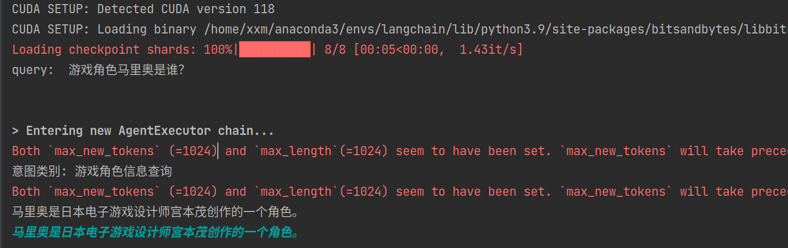
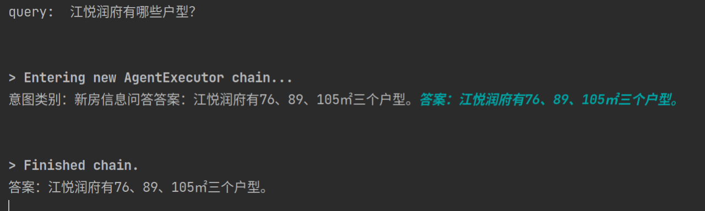

## 基于langchain编写智能体

### 启动命令
```shell
python3 demo.py \
  --model 你的模型路径 \
  --max_length 1024 \
  --temperature 0.1
```

### 运行结果


### agent与vllm融合的启动命令

```shell
python3 demo2.py \
  --model 你的模型路径 \
  --max_length 1024 \
  --temperature 0.1
```
###### 注：model2.py对应的self.api_base = 'http://192.168.204.120:7000/v1'，修改成自己的vllm服务地址
### 运行结果
